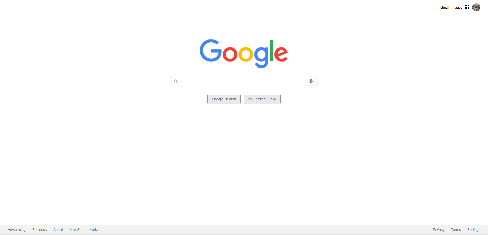

# css-odev3-google
patika.dev / kodluyoruz.org css eğitiminin 3. ödevi Google'ın güncel sayfası.

## İstenilenler
- [Google taslak](https://github.com/Kodluyoruz/taskforce/tree/main/css/odev2/google_homepage) sayfasının güncel google sayfasına benzetilmesi.
(*Üstdeki linkden ödev dosyalarını indirmek için [DownGit](https://downgit.github.io/#/home) kullanabilir veya [buradan](https://drive.google.com/drive/folders/1Judez8Dqey-BHDjxZ1PnUwGhIMERNkbV) indirebilirsiniz.*)
- Fark ettiyseniz logo eski bir Google logosu. Bu logoyu günümüzde logo ile değiştirmelisiniz. Kullanmanız gereken logo assets klasöründe bulunmakta.

- Üstteki alanı sağ tarafa alın ve fotoğrafı kendi fotoğrafınız ile değiştirin ve fotoğrafın kenarlarını yarıçap özelliği ile düzenleyiniz.

- Arama yapılacak alanın kenarlarını yarıçap özelliği ile düzenleyiniz.

- Arama simgesi gibi sesle arama simgesini de siz ekleyin. (Nasıl yapıldığını görmek için Google Ana Sayfa'dan İncele ile yazılanları inceleyiniz.)

- Arama alanında yazı yazılan yerin genişliği 480px olmalı ve kenarlığı olmamalı.

- Buttonları ortaya alıp üstünden ve sağından boşluklar veriniz. Button kenarları 1px kalın #f2f2f2 renginde olmalı. Yazı tipi Arial, yazı rengi #5f6368, yazı boyutu 14px olmalı. Button yüksekliği 36px olmalı.

- Buttonlara aynı arama alanında olduğu gibi gölge veriniz.

- Footerda arkaplan rengini #f2f2f2 yapınız ve liste noktalarını ortadan kaldırın

## Sonuç
